## ARCHITETTURA SQL
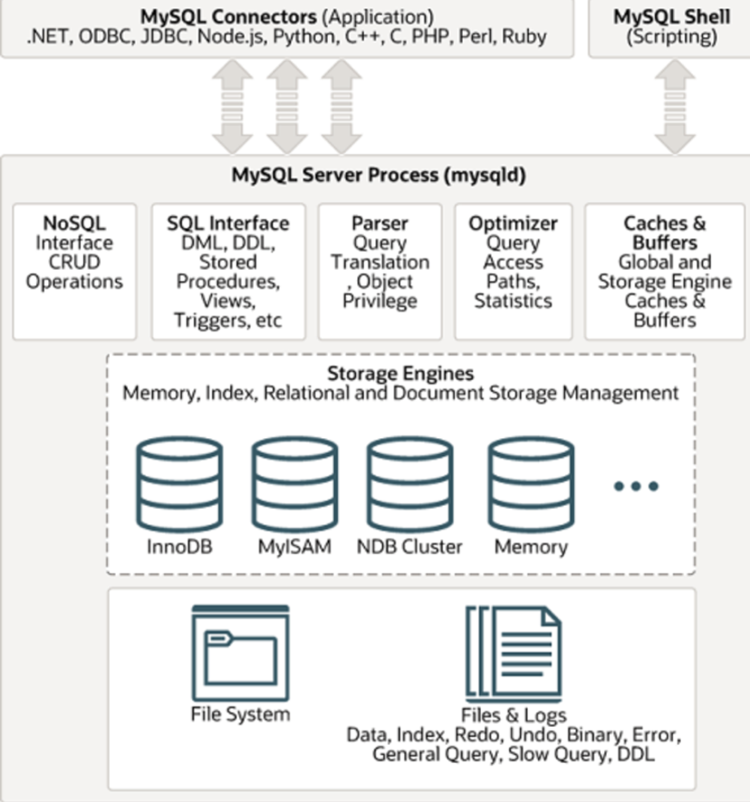

**Engine:** insieme di codice e algoritmi che consentono la gestione dei database. 

**InnoDB:** engine più completo che gestisce anche le transazioni. 

## CARATTERISTICHE LINGUAGGIO SQL
Il linguaggio sql è un linguaggio dichiarativo: non dobbiamo scrivere un algoritmo. Devo solo dichiarare cosa voglio e sarà poi l’engine ad implementare il codice per fornirmi il risultato.

È possibile creare utenti con diversi privilegi. L’utente root è quello con il massimo dei privilegi. 

### Esempio linguaggio dichiarativo
Se io avessi un elenco con tutti gli studenti del Greppi e voglio recuperare l’elenco degli studenti della 5IA.  
Per farlo si implementerebbe il seguente codice:

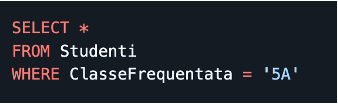

Non sto dicendo cosa devo fare ma cosa voglio fare. Sarà poi l’engine a farmi l’algoritmo per far si che la cosa che ho scritto venga effettuata.

## MODI DI UTILIZZO SQL
1. **Modalità interattiva:** si utilizza un interprete di comandi testuale o grafico che permette di eseguire e visualizzare i risultati delle query. In modalità interattiva io faccio una query e vedo immediatamente il risultato. 

2.	**Modalità programma:** l’applicativo si deve connettere al database e inietta codice sql nella richiesta.

## COMPONENTI LINGUAGGIO SQL
- **DDL: Data Definition Language** – contiene le istruzioni per creare il modello dei dati. Qui dentro si va a definire la struttura dei dati

- **DML: Data Manipulation Language** – contiene quelle istruzioni che ci permettono di manipolare i dati (recuperare i dati da una tabella, inserire dei dati, modificare dei dati, cancellare dei dati).

- **DCL: Data Control Language** – ci sono le istruzioni che mi permettono di definire chi può fare cosa. Posso creare degli utenti e definire permessi per ogni utente.

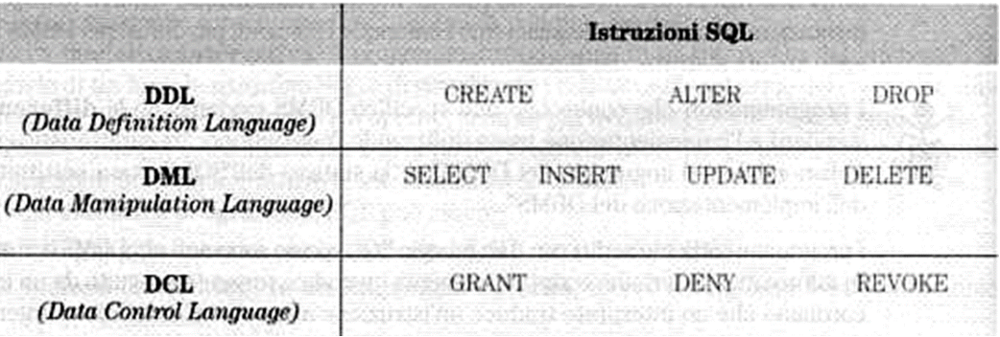

**Principio minimo privilegio:** un utente deve avere dei permessi minimi per ciò che deve fare in modo che l’effetto di un potenziale attacco sia comunque ridotto. Non deve avere privilegi più elevati rispetto a quello che deve fare. 

## CREARE UN DATABASE
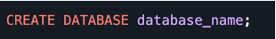

Tutte le istruzioni terminano con il ;

Le parentesi quadre indicano parametri opzionali

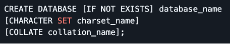

In questo esempio il [IF NOT EXIST] indica un parametro opzionale. Se non si mettono questi parametri opzionali si assumeranno i valori di default.

### Valori di default
- Default character set: utf8mb4
- Collection: utf8mb4_0900_ai_ci

## CREARE UNA TABELLA
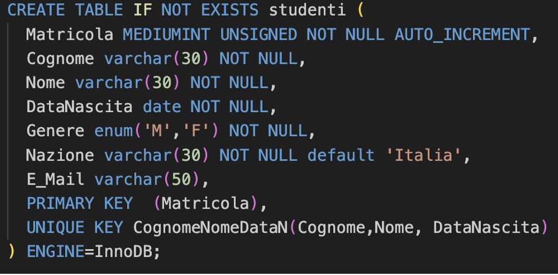

## VISUALIZZARE LA STRUTTURA DI UNA TABELLA

E' possibile visualizzare una tabella inviando il comando *describe [nome tabella]*

## POPOLAMENTO DEL DATABASE

Il popolamento del database corrisponde con l’inserimento degli elementi nella tabella.

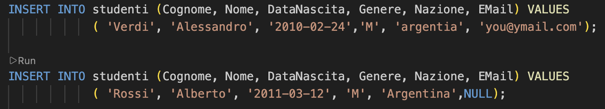

## MOSTRARE DATI DI UNA TABELLA

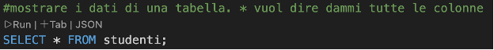

Se metto * visualizzerò tutte le colonne (tutti i dati).

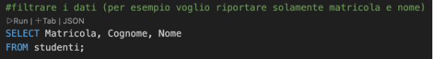

Tramite la select metto i campi che voglio visualizzare.

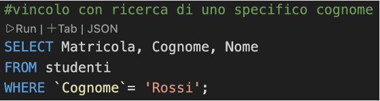

Tramite il where posso dire di cercare uno studente con cognome = a quello che voglio. Quindi visualizzerò solamente quello studente o quegli studenti.

**E’ possibile fare tutto questo anche tramite shell**

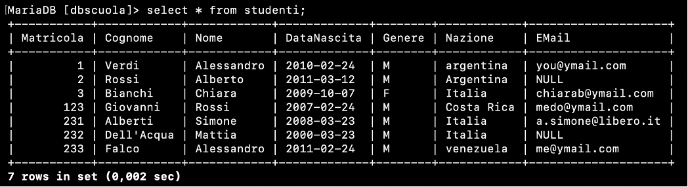

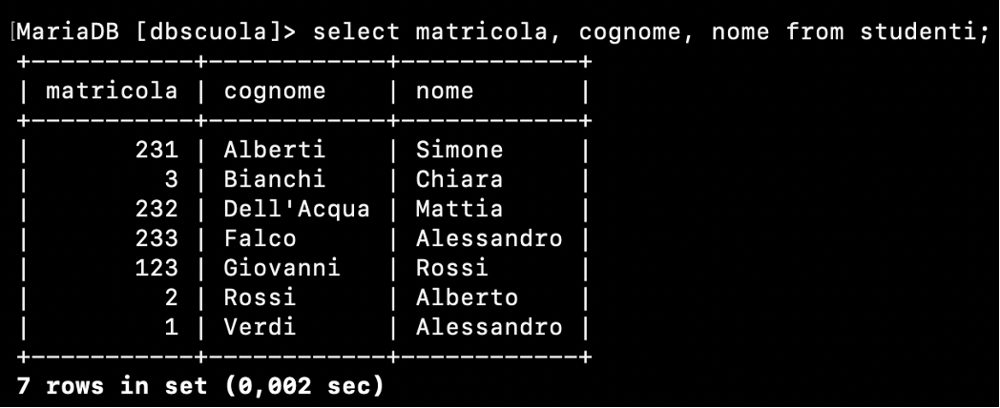

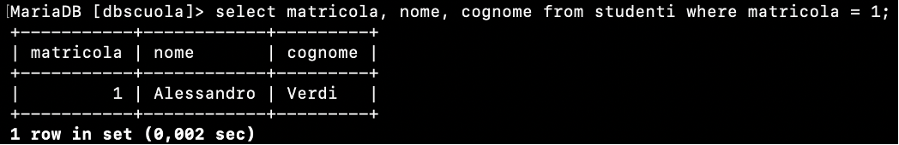

## CREAZIONE AUTOMATICA TABELLA

Questo comando: *show create table [nome tabella] \G*, che si invia tramite shell mi permette di andare a visualizzare il comando da fornire al server per ricreare una tabella uguale a quella passata nel comando.

L’output sarà infatti il seguente:

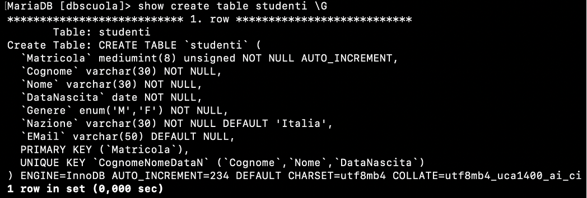

## RINOMINARE UNA COLONNA IN UNA TABELLA

Quando vado a richiamare il nome nel comando metto AS e nome che voglio mettere racchiuso tra singoli apici. Posso anche non mettere AS. Di seguito i 2 esempi.

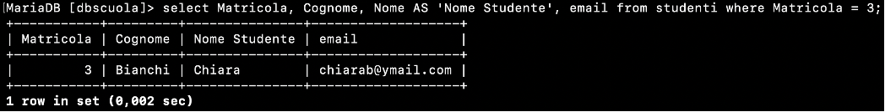

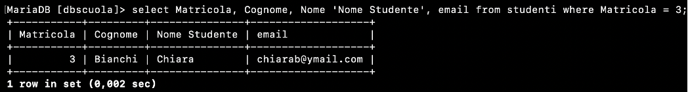

## CANCELLARE UN DATO

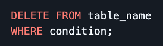

## AGGIUNGERE PIU’ COLONNE

Aggiunta di una colonna:
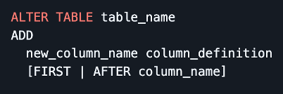

Aggiunta di più colonne:
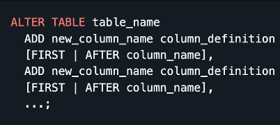

Modifica di una colonna:
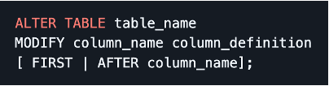

Modifica di più colonne:
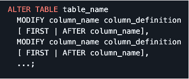

Ridenominazione di una colonna:
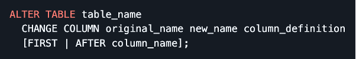

Cancellazione di una colonna:

Ridenominazione di una tabella:
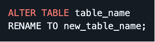

## ALTRE QUERY
Come cercare l’elenco degli studenti che non hanno la mail: tramite il comando *where email <=> null;*

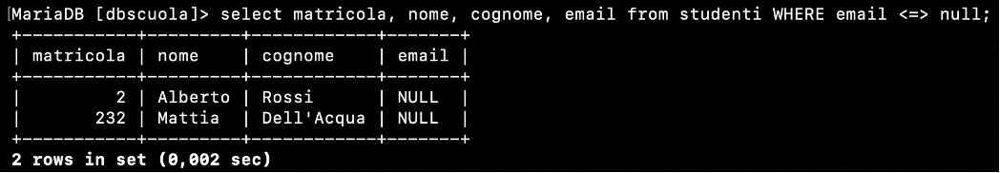

Modificare la nazionalità di uno studente: 
 *UPDATE [nome della tabella] SET [nuovo valore] WHERE [Campo]=[Valore] LIMIT 1;*

Bisogna stare molto attenti a inserire il where in questo caso perché altrimenti vado a modificare e trovo tutti con scritto il nuovo valore. 

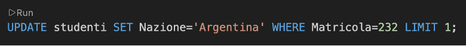

Il limit serve per indicare il numero massimo di righe che possono essere modificate. 

## ESEMPIO DI INTEGRITA’ REFERENZIALE

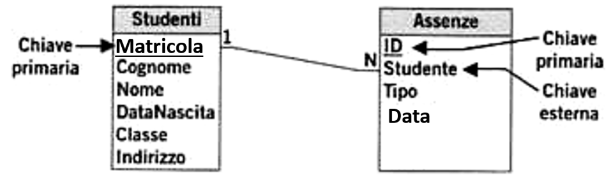

Ogni assenza ha un suo identificativo: ovvero l’id (chiave primaria). L’assenza però deve essere riferita a uno studente. Quindi il campo studente dentro ad assenza è la foreign key (chiave esterna), ovvero quel campo che indica lo studente a cui quell’assenza è stata assegnata. 

**Proprietà di integrità referenziale:** il database assicura che ci sia coerenza tra i dati che sono collegati tramite il vincolo di chiave esterna. 

Per esempio, se io voglio inserire un’assenza a uno studente che non esiste questa cosa non sarà possibile. 

Non è possibile eliminare uno studente che ha delle assenze perché rimarrebbero le assenze associate ad uno studente che non esiste. Se non ha nessuna assenza posso cancellarlo. 

**Come si fa in SQL a dire che un campo è chiave esterna**

Si usa la parola PRIMARY KEY per le chiavi primarie e FOREIGN KEY per le chiavi esterne. Come nell’immagine. 

AUTO_INCREMENT serve per far si che se non si mette l’id lo mette in automatico prendendo il maggiore e facendo +1.

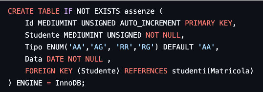

Se non metto auto_increment dovrei fare 2 query:
- Select max(matricola) from studenti
- Poi fare più uno e inserire io manualmente.

Quindi è molto più comodo usare l’altro metodo in modo che l’sql assegni in modo autonomo l’id. 