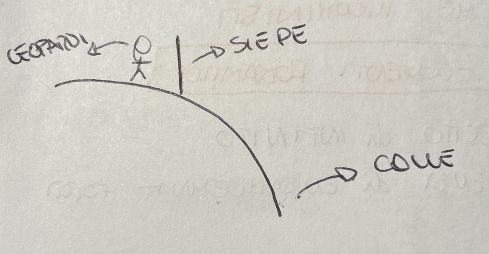

## VITA
Nasce a Recanati nel 1978

C'era già la rivoluzione francese e nuovi ideali. 

A Recanati (marche) questi ideali non erano ben accolti.

Era figlio di una famiglia aristocratica (cattolica). La madre aveva impartito ai figli una fortissima educazione religiosa. 

Era primogenito quindi si puntava tutto su di lui.

### Madre
- Ossessione per la religione.
- Si dedica a una vita di rinunce per ricolmare le finanze.
- Era molto tirchia.
- Attenzione ossessiva per le finanze.

### Padre
Era un **erudito:** per lui lo studio e la conoscenza era il valore più alto. Spende molto nei libri. 

Aveva una biblioteca di famiglia.

Le uniche gioie della sua vita sono i suoi fratelli. 

Leopardi si segnala fin da subito per un talento straordinario --> lo studio.
 Già all'età di 14 anni il prete dice che non ha più niente da insegnargli.

Nel 1817 inizia a scriversi delle lettere (corrispondenza) con **Pietro Giordani.** Era un liberale e critico letterario.
 Comunicava con lui solo via lettera.

La corrispondenza va avanti un bel po' finchè Giordani non gli scrive una cosa sensazionale --> che lo andrà a trovare di persona (per lui era un onore). 

Leopardi ha molti problemi fin dall'adolescenza: 
- Ha 2 gobbe
- Spina dorsale storta
- Alto 1.40m

Aveva una salute molto cagionevole, per questo preferiva una carriera ecclesiastica (vita più leggera).

Lo zio lo vuole portare a Roma ma il padre (che era molto legato al figlio) dice di no. 
 Il padre era d'accordo con l'idea di carriera ecclesiastica ma senza uscire da Recanati perchè uscire significava essere esposti ad altri pensieri.

Si definisce un autore classico.

Pietro Giordani gli fa visita e succede un *"patatrac".*
 Arriva a Recanati e ha idee completamente diverse da quelle del padre di Leopardi. Infatti lui e i fratelli sono felicissimi mentre la madre e il padre meno. 
 Un giorno il padre non trovava i figli e quindi li cerca e scopre che sono andati con Giordani (avevan preso una carrozza). Il padre si arrabbia.
 Inoltre quando Giordani dice la parola *rivoluzione* il padre si inalbera.
 A questo punto Leopardi capisce di non poter più restare a Recanati e tenta una fuga --> nel 1821 appena era diventato maggiorenne.
 Dopo la tentata fuga c'è un confronto tra lui, il padre e lo zio.
 Si vede come voleva reagire (urlare e infuriarsi) ma poi si capisce come in realtà quella era solo immaginazione e le parole le pronuncia con un tono normale molto basso. 

Nel 1819 dopo tutta questa situazione, scrive **l'infinito.**

## L'INFINITO
E' una poesia romantica (già il titolo lo fa pensare), ma ha certi tratti illuministi.

### Di cosa parla
In questa poesia si chiede che cosa ci sia dall'altra parte della siepe. L'infinito ha più o meno lo stesso concetto.

Leopardi ha un punto di vista che rovescia le carte in tavola. 
 Per Leopardi il fatto che un uomo abbia un limite (l'uomo ha una fine), diventa proprio quello che permette di far capire il concetto dell'infinito.

in questa poesia si racconta di come in qualche modo l'uomo possa abbattere questi limiti. 
 Questo modo è *l'immaginazione.*

**L'esistenza di un limite è la pre-condizione fondamentale per accedere all'infinito.**

Questo limite in questa poesia è la siepe.

E' importante il fatto del colle perchè se non ci fosse la siepe essendo su un'altura si sarebbe visto il panorama. 
 **L'esistenza del limite (questa siepe), è la pre-condizione fondamentale per far usare l'immaginazione a Leopardi.**

Questa poesia è a tratti illuminista perchè contiene argomentazioni chiare.

Inizia col raccontarci che c'è qualcosa che gli esclude la possibilità di vedere gran parte del panorama. 
 Poi c'è un **ma** che fa capire che la frase dopo è in contraddizione a quella prima.
 Successivamente al ma, con la frase retta da *"io nel pensier mi fingo"*, ci dice che lo sa che è una finta e che è immaginazione. --> sa che è una finta perchè lo dice.

Successivamente dice *"ove per poco il cor non si spaura"* --> dice che questo luogo a dove lui accede per poco non lo fa spaventare.

Nella prima parte della storia chiamava la siepe *"questa"*, nella seconda parte invece la chiama *"quella"* --> ha iniziato il viaggio e l'ha oltrepassata.

Poi la chiama di nuovo *"questa"* --> è tornato di qua. Viene richiamato di qua a causa del vento.

A questo punto con *"sovvien l'inverno"* dice che gli viene in mente un tempo eterno (richiama l'infinito). 

**L'infinito nella prima parte è un infinito spaziale, mentre nella seconda è un infinito temporale.** 

## OPERETTE MORALI
E' un'opera molto particolare

Vengono pubblicate nel 1827, anno della prima edizione de I Promessi Sposi (ma sono completamente diversi)

Sono qualcosa di nuovo ed innovativo: **hanno una forte presenza di una componente fantastica e non realistica.** Ci sono personaggi inventati.

**2 elementi importanti**
1. **Fantasia**
2. **Alto tasso di ironia**

**E' un'opera che si rifà parecchio all'illuminismo** perchè Leopardi è legato per formazione a questo movimento.

Nelle operette morali è molto presente **l'utilizzo dei sensi** e il **ragionamento.**

Sono composte da testi slegati tra loro - non c'è una storia che continua.

In ogni operetta ci sono dei personaggi che dialogano tra loro e formano una storia. La storia però porta sempre a concetti filosofici abbastanza complessi. 

Ci sono 2 fasi del pessimismo di Leopardi:
1. **PESSIMISMO STORICO**
2. **PESSIMISMO COSMICO**

### PESSIMISMO STORICO
Secondo Leopardi la felicità per un uomo coincide con un piacere infinito. Di conseguenza l'uomo è insoddisfatto per non poter ottenere mai un piacere infinito. Per questo si dice **pessimismo**.

La natura (madre benigna), può dare un rimedio a questa cosa perchè offre all'uomo di accedere all'immaginazione per un attimo ed essere felice (come nell'infinito). 

**Storico** perchè nel passato l'uomo era più felice ma col passare della storia poteva accedere meno all'illusione.

Ecco perchè **pessimismo storico.**

### DIALOGO FRA LA NATURA E UN ISLANDESE 
In questo testo si riconosce **un'evoluzione del pensiero di Leopardi.**

Leopardi aveva un'opinione positiva della natura ma qui si presenta come cosa negativa. 

In questo brano l'islandese dice che la vita è uno schifo e che vuole isolarsi nella natura per trovare la felicità e vuole allontanarsi dagli uomini.

Essendo in Islanda è avvantaggiato ma scopre che il problema non erano solo gli uomini ma anche il clima e in Islanda non trova un posto che riuscisse a dargli felicità.

Dice che ciò che serve alla sopravvivenza dell'uomo (sole e aria), sono cose negative. Di conseguenza comincia a provare un rancore sempre più forte per la natura.

A questo punto va in Africa e qui trova una creatura con cui inizia un **dialogo --> con la natura.**

Da qui in poi in testo è tutto parlato sembra quasi diventare un copione.

Quando l'islandese trova davanti la natura gli racconta la sua storia ma con tutti il rancore che ha dentro. Il racconto è molto incalzante e sembra arrabbiato. Arriva ad un **climax** dopo che ha provato climi diversi in tutto il mondo ma non trova tregua. 

Lui è molto arrabbiato e parla molto. La natura al contrario è molto calma e parla pochissimo (poche parole e solo 2 volte). 

Risponde che il suo obiettivo è tutt'altro che far felici gli uomini e che se anche dovesse capitargli di far estinguere la razza umana non se ne accorgerebbe. 

**A questo punto l'islandese fa una cosa estremamente illuminista.**

Fa un esempio: dice che viene invitato a casa di una persona e questa lo tratta malissimo lui si lamenterebbe. Successivamente l'uomo gli dice che non ha fatto tal casa per lui. A questo punto l'islandese direbbe che poteva non invitarlo.

Quindi chiede alla natura perchè ha invitato l'uomo in questo universo.

**Tipico dell'illuminismo usare la ragione per smontare tesi.**

A questo punto parla la natura per la seconda e ultima volta sempre calma.

Dice che c'è la nascita e c'è la morte non è che si può togliere una delle due. (ovviamente la morte e la sofferenza)

**L'universo è basato su questa legge** delle 2 cose: **produzione e distruzione.**

L'islandese fa una domanda: a chi piace questa legge (se piace a qualcuno che c'è sopra). **Domanda quindi dell'esistenza di Dio.**

La domanda rimane senza risposta. 

La risposta avviene nel finale e non è parlata ma sono fatti (sono 2 finali).

Arrivano 2 leoni che mangiano l'islandese e vivono ancora solo 1 giorno.

Arriva il vento che lo stende a terra e lo mummifica (seppellito sotto la sabbia), successivamente dei viaggiatori lo trovano e lo portano in un museo.

Entrambi i 2 finali sono molto sbrigativi.

Il fatto dei 2 finali ci comunica che l'islandese è morto ma non si sa come o ci sono dei dubbi su come sia morto.

Siccome lui muore l'idea centrale di questo testo è che **la natura è sopra a tutto (più forte).**

La natura è sempre stata di poche parole infatti nel finale passa direttamente ai fatti. 

In questo testo l'islandese crea una sorta di "legame" col lettore perchè tratta cose che riguardano tutti. Questa cosa del finale che viene liquidato così velocemente + l'incertezza della sua morte contribuisce molto a dare l'idea di incuranza. Questo stride un po col testo perchè si era creato un legame tra lettore e islandese.

#### I 2 finali
**Primo finale:** i 2 leoni seguono la legge del più forte ma erano così affamati che nonostante avessero mangiato l'islandese sopravvivono solamente per un altro giorno.

**Secondo finale:** il narratore quando racconta della sorte dell'islandese sembra che lo faccia quasi con divertimento. 
 Ciò che si può concludere è che tutto quello che ha fatto non è servito a niente. Però da mummia viene riportato in un museo.
 La sua vita era quindi qualcosa da ammirare in un museo, ma di fatto era una cosa totalmente inutile.

**In questo testo Leopardi passa da pessimismo storico a pessimismo cosmico.**

### PESSIMISMO COSMICO
La natura inizia ad essere vista come una matrigna perchè **è la natura ad averlo messo in quella situazione.**

**Questo testo è una fortissima condanna dell'antropocentrismo**, ovvero della credenza che l'uomo sia al centro di tutto. Di conseguenza è un **testo anti illuminista** in quanto l'illuminismo si basava sull'uomo al centro di tutto. 

inoltre l'idea di questa natura indomabile rimanda al romanticismo. 