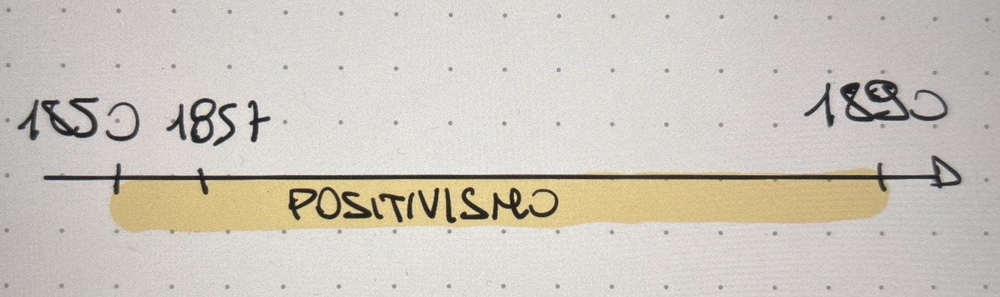

## INTRODUZIONE

Il principale ideologo del positivismo è **Comte**, un francese.

Secondo questo movimento l'unica conoscenza valida e solida è quella che viene dal metodo scientifico.

Questo movimento segue una filosofia:
- **Materialista**
- **Determinista** --> tutto è un meccanismo di causa ed effetti.

**Taine** afferma --> l'esistenza di un essere umano dipende da 3 fattori.
1) **Razza** --> codice genetico (DNA).
2) **Ambiente** in cui si trova a vivere.
3) **Momento storico**
 Se alla nascita ho queste 3 cose allora posso già sapere come sarà l'individuo. Questo prende il nome di determinismo.
4) **Evoluzionismo** --> variabilità --> essere tutti diversi (vale per qualsiasi specie).
 Da questo nasce anche la **teoria di Darwin** ovvero il concetto di lotta per la sopravvivenza --> sopravvive solo chi riesce ad adattarsi. **Sopravvive il più forte**. Questo prende il nome di **selezione naturale**.
 Darwin ci descrive quindi la natura come una cosa crudele.

### Darwinismo Sociale
Secondo Spencer le regole di Darwin non valgono solo negli animali ma anche nella società.

Il concetto principale del Darwinismo sociale è che **anche nella società il più forte deve imporsi sul più debole.**

La società di fine 800 era profondamente razzista.

## 1857 - FLAUBERT, "MADAME BOVARY"
### Storia del testo
Madame Bovary è la protagonista.

E' una donna nata da un contesto difficile.
- Rimane orfana di madre.
- Viene educata dalle suore (ai quei tempi il padre non si prendeva cura dei figli).

**Sarà sempre una donna insoddisfatta.** Trova un modo per evadere da questa cosa ovvero leggere un sacco di libri romantici.
 Libri che raccontano di storie d'amore perfette e di sentimenti dell'800.

Lei sogna questa cosa e il suo principe azzurro.

Questa infanzia rovina Emma Bovary. Ogni cosa che vede la vede *"sotto quella maschera"* (se si avvicina un uomo, indipendentemente da chi sia, lei lo vede come il principe azzurro anche se era magari un potenziale delinquente). 

Si sposa con Bovary (fa il medico, lavoro nobile) ed era innamorata persa. Sogna un futuro splendido con lui. 
 In verità era uno svogliato che non faceva mai nulla e non aveva voglia di fare niente (nè viaggi nè niente di quello che aveva sognato lei).

Lei continua però a sognare --> troverà degli amanti (3). 
 Non essendo in grado di vedere la realtà l'amante più importante dei tre si approfitta di lei sia fisicamente che economicamente. 
 Quindi entra in una situazione sempre più complicata.

A un certo punto si rende conto che la possibilità che il vero marito (Bovary), venga a sapere tutte era molto vicina perchè l'amante la ricatta che o le da i soldi altrimenti avrebbe detto tutto al marito. 

A questo punto lei si ammazza.

### C'è qualcosa di diverso dal passato
**Questa è una cosa molto particolare per il passato.**

Ci sono 2 cose che rompono le righe col passato:
- **Suicidio** --> andava contro la religione ma è stato raccontato. Raccontare un suicidio all'epoca era assurdo.
- **Tradimento** --> era importante la responsabilità e il buon nome.
 Qui c'era stato il tradimento, ovvero lo svelamento di alcune verità scomode nascoste.

Per questo motivo viene detto **realismo**.

Flaubert a causa di questo viene processato.

Il problema non era solo aver raccontato cose come il suicidio e il tradimento ma anche come erano state raccontate.
 Se Flaubert avesse detto che Emma era una disgraziata e che le persone non avrebbero dovuto prendere esempio, avrebbero anche accettato che si fossero trattati quegli argomenti.

### Ricerca di impersonalità
In questo testo non c'è un giudizio personale perchè il narratore ricerca **l'impersonalità.**
 Non si capisce cosa pensa il narratore a riguardo dei temi trattati.

Se il narratore si fa sentire di meno all'interno del testo si vede di più la realtà senza che nessuno ce la faccia vedere attraverso i suoi occhi.
 Ancora una volta questo è un elemento importantissimo per il **realismo.**

### Come viene ottenuta l'impersonalità
1) **Descrizioni:** sono molto dettagliate e vengono condotte attraverso gli occhi di un personaggio ma questo non viene detto.