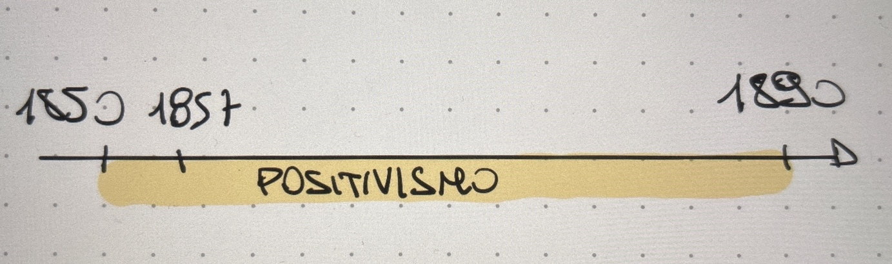

## INTRODUZIONE

Il principale ideologo del positivismo è **Comte**, un francese.

Secondo questo movimento l'unica conoscenza valida e solida è quella che viene dal metodo scientifico.

Questo movimento segue una filosofia:
- **Materialista**
- **Determinista** --> tutto è un meccanismo di causa ed effetti.

**Taine** afferma --> l'esistenza di un essere umano dipende da 3 fattori.
1) **Razza** --> codice genetico (DNA).
2) **Ambiente** in cui si trova a vivere.
3) **Momento storico**
 Se alla nascita ho queste 3 cose allora posso già sapere come sarà l'individuo. Questo prende il nome di determinismo.
4) **Evoluzionismo** --> variabilità --> essere tutti diversi (vale per qualsiasi specie).
 Da questo nasce anche la **teoria di Darwin** ovvero il concetto di lotta per la sopravvivenza --> sopravvive solo chi riesce ad adattarsi. **Sopravvive il più forte**. Questo prende il nome di **selezione naturale**.
 Darwin ci descrive quindi la natura come una cosa crudele.

### Darwinismo Sociale
Secondo Spencer le regole di Darwin non valgono solo negli animali ma anche nella società.

Il concetto principale del Darwinismo sociale è che **anche nella società il più forte deve imporsi sul più debole.**

La società di fine 800 era profondamente razzista.

## 1857 - FLAUBERT, "MADAME BOVARY"
### Storia del testo
Madame Bovary è la protagonista.

E' una donna nata da un contesto difficile.
- Rimane orfana di madre.
- Viene educata dalle suore (ai quei tempi il padre non si prendeva cura dei figli).

**Sarà sempre una donna insoddisfatta.** Trova un modo per evadere da questa cosa ovvero leggere un sacco di libri romantici.
 Libri che raccontano di storie d'amore perfette e di sentimenti dell'800.

Lei sogna questa cosa e il suo principe azzurro.

Questa infanzia rovina Emma Bovary. Ogni cosa che vede la vede *"sotto quella maschera"* (se si avvicina un uomo, indipendentemente da chi sia, lei lo vede come il principe azzurro anche se era magari un potenziale delinquente). 

Si sposa con Bovary (fa il medico, lavoro nobile) ed era innamorata persa. Sogna un futuro splendido con lui. 
 In verità era uno svogliato che non faceva mai nulla e non aveva voglia di fare niente (nè viaggi nè niente di quello che aveva sognato lei).

Lei continua però a sognare --> troverà degli amanti (3). 
 Non essendo in grado di vedere la realtà l'amante più importante dei tre si approfitta di lei sia fisicamente che economicamente. 
 Quindi entra in una situazione sempre più complicata.

A un certo punto si rende conto che la possibilità che il vero marito (Bovary), venga a sapere tutte era molto vicina perchè l'amante la ricatta che o le da i soldi altrimenti avrebbe detto tutto al marito. 

A questo punto lei si ammazza.

### C'è qualcosa di diverso dal passato
**Questa è una cosa molto particolare per il passato.**

Ci sono 2 cose che rompono le righe col passato:
- **Suicidio** --> andava contro la religione ma è stato raccontato. Raccontare un suicidio all'epoca era assurdo.
- **Tradimento** --> era importante la responsabilità e il buon nome.
 Qui c'era stato il tradimento, ovvero lo svelamento di alcune verità scomode nascoste.

Per questo motivo viene detto **realismo**.

Flaubert a causa di questo viene processato.

Il problema non era solo aver raccontato cose come il suicidio e il tradimento ma anche come erano state raccontate.
 Se Flaubert avesse detto che Emma era una disgraziata e che le persone non avrebbero dovuto prendere esempio, avrebbero anche accettato che si fossero trattati quegli argomenti.

### Ricerca di impersonalità
In questo testo non c'è un giudizio personale perchè il narratore ricerca **l'impersonalità.**
 Non si capisce cosa pensa il narratore a riguardo dei temi trattati.

Se il narratore si fa sentire di meno all'interno del testo si vede di più la realtà senza che nessuno ce la faccia vedere attraverso i suoi occhi.
 Ancora una volta questo è un elemento importantissimo per il **realismo.**

### Come viene ottenuta l'impersonalità
1) **Descrizioni:** sono molto dettagliate e vengono condotte attraverso gli occhi di un personaggio ma questo non viene detto.
 E' come se il narratore si immedesimasse in Emma (è lei che ha vissuto le cose).
 Questa è una tecnica utilizzata per ottenere l'impersonalità. 
 Prima si diceva "si vide", adesso "Emma vide".

2) **DIL - Discorso indiretto libero:**
- Discorso diretto: Emma pensò: "..."
- Discorso indiretto: Emma pensò che ...
 Il discorso indiretto libero è un mix tra questi 2: ci sono elementi simili al discorso indiretto come per esempio i tempi verbali e la voce che è sempre quella del narratore e non del personaggio che ha vissuto. Ma ci sono anche elementi del discorso diretto ovvero espressioni puramente colloquiali come *"chissà"* ecc.

Tutto questo contrinuisce a dare impersonalità.

Il narratore continua a mantenere il controllo ma raccontando sotto gli occhi di emma.

I segnali del discorso indiretto libero sono anche le frasi col !/? alle fine. Di solito le frasi che terminano in quel modo sono le esclamazioni dei personaggi.

Questo è un romanzo che ha l'obiettivo di raccontare la realtà così com'è (anche negli aspetti sgradevoli).
 Per esempio, Gericault che va nei manicomi e dipinge le facce delle persone ricoverate.

Dal 1864 dopo il realismo e a partire da questo si sviluppa il **naturalismo francese.**

## NATURALISMO
Entrambi i movimenti hanno come base il realismo. 

Il naturalismo può essere considerato il tentativo di trasferire tutti i principi del positivismo alla letteratura.

### Zola
Cerca di creare una letteratura che abbia come base i principi della scienza (non riuscirà)
 Pubblica un saggio --> **1880 - Il Romanzo Sperimentale**. Un testo in cui va a spiegare il concetto di scrittore-scienziato. 

1) **No rappresentazione del bello ma del vero**  
Il vero è sempre bello anche se sgradevole.

2) **Impersonalità**  
Fa una metafora --> come un tecnico di laboratorio non ha emizioni per ciò che sta trattando, anche il narratore non deve affezionarsi ai personaggi.

3) **Narrazione = esperimento di laboratorio**  
Osservazione di un fatto --> un personaggio di una certa razza lo metto in una certa epoca in un certo luogo e sperimento cosa succede. 

4) **No introspezione**  
La vita interiore e i pensieri dei personaggi, il narratore deve limitarsi a ciò che è oggettivo e scientifico. La vita interiore è soggettiva e può essere inventata.

5) **Romanzo**  
Esiste solo il romanzo, la poesia è completamente esclusa.

6) **Contenuti**  
Esplorazione di tutte le classi sociali ma il narratore deve seguire un ordine. Deve partire dalle più basse perchè sono le più semplici per arrivare alle più alte ossia le più complesse.

7) **La forma va in secondo piano**  
Da il primo posto ai contenuti e al metodo con cui sono narrati. 

### Zola - L'Assomoir
1877 - L'Assomoir - L'Ammazzatoio

Assomoir è il nome di un'osteria di bassissimo livello di Parigi in un quartiere abitato da persone di bassa classe sociale. 

Tutti i personaggi o prima o poi finiscono all'osteria dove annegano i loro dispiaceri con l'alcool.

**L'assomoir è un romanzo di denuncia** che vuole evidenziare la piaga dell'alcolismo.  
La volontà di denuncia è un altro elemento fondamentale del positivismo.  
Zola punta a dare il suo contributo al progresso della società. 

**Esempio:**

Gervaise vive nella sua casa aspettando il marito che non torna perchè la sta tradendo.  
L'importante di questa scena è che il narratore non ci dice mai cosa pensa di lei.  
Si capisce che è triste perchè si mette a piangere (lo fanno quindi capire direttamente le emozioni).

**Aspetto importante è come viene fatta la descrizione della stanza**  
Il narratore racconta degli oggetti presenti nella stanza con un ordine ben preciso. Fino a creare un climax.  
I bambini descritti mentre dormono creano tenerezza al lettore.  
Tutto è disastrato, poi i bambini creano tenerezza, si crea un climax. 

## VERISMO
E' una corrente che si sciluppa in Italia nel 1878 che si inspira partendo dal naturalismo francese.

I principali esponenti sono **Verga** e **Capuana**, entrambi siciliano.

Verga nel 1878 scrive *"Rosso Malpelo"*

Alla fine degli anni 70 fa una svolta: la **svolta verista**.

- Nel 1877 legge l'assommoir e decide che anche in Italia bisogna dare una svolta. 

- Nel 1877 arriva a Milano Capuana che aiuta molto Verga a maturare questa consapevolezza letteraria. 

- Inchiesta Franchetti-Sonnino --> è un'inchiesta promossa dalla destra storica con l'obiettivo di studiare le condizioni del meridione (analfabetismo, mortalità infantile ecc.).  
Legge questa inchiesta e lo sorprende che mette in evidenza i problemi, in particolare lo stupisce il capitolo sul lavoro minorile: **i carusi**.

Per questo viene scritto ***Rosso Malpelo*** 
Parla di un bambino dai capelli rossi e per questo discriminato. 

**Anche il narratore di Verga è impersonale.**
Cambia però il modo per ottenere l'impersonalità

### Come ottiene l'impersonalità 
Già nella prima frase si capisce che il narratore subito esprime pregiudizi sul ragazzo.  
Ha i capelli rossi e ri chiama *Malpelo*, poi aggiunge che aveva i capelli rossi perchè era cattivo e prometteva di diventare un bel delinquente. 