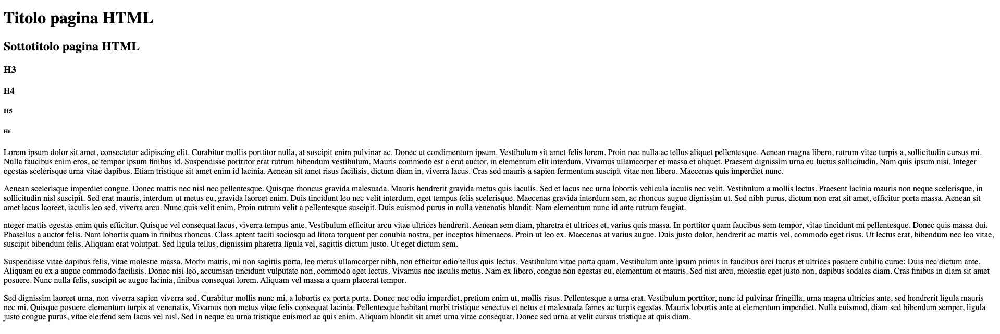

## INTRODUZIONE
Il linguaggio HTML è stato inventato al CERN: un centro di ricerca nucleare europeo.

È un linguaggio non compilato ma interpretato. Quindi c’è un interprete che lo converte in linguaggio macchina. 

Non è un linguaggio di programmazione ma è un linguaggio di **formattazione.** Ovvero un linguaggio che ci permette di creare un formato. Non c’è niente di dinamico che cambia, ciò che è scritto rimane

## COMANDI PRINCIPALI
È strutturato in tag. Ce ne sono alcuni obbligatori per poter creare una pagina e una struttura base dell’html:
- **doctype:** definisce il tipo di documento e poi lo specifica
- **tag html**: definisce il linguaggio
- **head:** informazioni che definiscono la pagina e gli script
- **body:** contiene tutto il documento, ovvero ciò che viene visto

Per creare una pagina si prosegue quindi come segue:
``` html
<!DOCTYPE html>
    <html>
        <head>
            <!-- head sono le informazioni della pagina -->
        </head>
        <body>
            <!-- body è la struttura della pagina -->
        </body>
    </html>
```

## ALTRI COMANDI
- **title:** da il titolo
- **h1:** è il titolo 1 (grande), arriva fino a 6 (piccolo) ed è modificabile utilizzando lo stile.
- **tag br:** è un invio
- **tag p:** devo aprirlo e chiuderlo a inizio e fine del testo e il testo contenuto dei tag sarà trattato come paragrafo. 

### Esempio
``` html
<!DOCTYPE html>
<html>
    <head>
         <!-- head sono le informazioni della pagina -->
         <title> Homepage </title>
    </head>
    <body>
         <!-- body è la struttura della pagina -->
         <h1>Titolo pagina HTML</h1>
         <h2>Sottotitolo pagina HTML</h2>
         <h3>H3</h3>
         <h4>H4</h4>
         <h5>H5</h5>
         <h6>H6</h6>

         <p>
            Lorem ipsum dolor sit amet, consectetur adipiscing elit. Curabitur mollis porttitor nulla, at suscipit enim pulvinar ac. 
            Donec ut condimentum ipsum. Vestibulum sit amet felis lorem. Proin nec nulla ac tellus aliquet pellentesque. Aenean magna 
            libero, rutrum vitae turpis a, sollicitudin cursus mi. Nulla faucibus enim eros, ac tempor ipsum finibus id. Suspendisse 
            porttitor erat rutrum bibendum vestibulum. Mauris commodo est a erat auctor, in elementum elit interdum. Vivamus ullamcorper 
            et massa et aliquet. Praesent dignissim urna eu luctus sollicitudin. Nam quis ipsum nisi. Integer egestas scelerisque urna 
            vitae dapibus. Etiam tristique sit amet enim id lacinia. Aenean sit amet risus facilisis, dictum diam in, viverra lacus. 
            Cras sed mauris a sapien fermentum suscipit vitae non libero. Maecenas quis imperdiet nunc.
         </p>
         
         <p>
            Aenean scelerisque imperdiet congue. Donec mattis nec nisl nec pellentesque. Quisque rhoncus gravida malesuada. 
            Mauris hendrerit gravida metus quis iaculis. Sed et lacus nec urna lobortis vehicula iaculis nec velit. 
            Vestibulum a mollis lectus. Praesent lacinia mauris non neque scelerisque, in sollicitudin nisl suscipit. 
            Sed erat mauris, interdum ut metus eu, gravida laoreet enim. Duis tincidunt leo nec velit interdum, eget tempus felis 
            scelerisque. Maecenas gravida interdum sem, ac rhoncus augue dignissim ut. Sed nibh purus, dictum non erat sit amet, 
            efficitur porta massa. Aenean sit amet lacus laoreet, iaculis leo sed, viverra arcu. Nunc quis velit enim. Proin rutrum 
            velit a pellentesque suscipit. Duis euismod purus in nulla venenatis blandit. Nam elementum nunc id ante rutrum feugiat.
         </p>
         <p>
            nteger mattis egestas enim quis efficitur. Quisque vel consequat lacus, viverra tempus ante. Vestibulum efficitur arcu vitae 
            ultrices hendrerit. Aenean sem diam, pharetra et ultrices et, varius quis massa. In porttitor quam faucibus sem tempor, vitae 
            tincidunt mi pellentesque. Donec quis massa dui. Phasellus a auctor felis. Nam lobortis quam in finibus rhoncus. Class aptent 
            taciti sociosqu ad litora torquent per conubia nostra, per inceptos himenaeos. Proin ut leo ex. Maecenas at varius augue. Duis 
            justo dolor, hendrerit ac mattis vel, commodo eget risus. Ut lectus erat, bibendum nec leo vitae, suscipit bibendum felis. 
            Aliquam erat volutpat. Sed ligula tellus, dignissim pharetra ligula vel, sagittis dictum justo. Ut eget dictum sem.
         </p>
         <p>
            Suspendisse vitae dapibus felis, vitae molestie massa. Morbi mattis, mi non sagittis porta, leo metus ullamcorper nibh, 
            non efficitur odio tellus quis lectus. Vestibulum vitae porta quam. Vestibulum ante ipsum primis in faucibus orci luctus et 
            ultrices posuere cubilia curae; Duis nec dictum ante. Aliquam eu ex a augue commodo facilisis. Donec nisi leo, accumsan 
            tincidunt vulputate non, commodo eget lectus. Vivamus nec iaculis metus. Nam ex libero, congue non egestas eu, elementum et 
            mauris. Sed nisi arcu, molestie eget justo non, dapibus sodales diam. Cras finibus in diam sit amet posuere. Nunc nulla felis, 
            suscipit ac augue lacinia, finibus consequat lorem. Aliquam vel massa a quam placerat tempor.
         </p>
         <p>
            Sed dignissim laoreet urna, non viverra sapien viverra sed. Curabitur mollis nunc mi, a lobortis ex porta porta. 
            Donec nec odio imperdiet, pretium enim ut, mollis risus. Pellentesque a urna erat. Vestibulum porttitor, nunc id pulvinar 
            fringilla, urna magna ultricies ante, sed hendrerit ligula mauris nec mi. Quisque posuere elementum turpis at venenatis. 
            Vivamus non metus vitae felis consequat lacinia. Pellentesque habitant morbi tristique senectus et netus et malesuada fames 
            ac turpis egestas. Mauris lobortis ante at elementum imperdiet. Nulla euismod, diam sed bibendum semper, ligula justo congue 
            purus, vitae eleifend sem lacus vel nisl. Sed in neque eu urna tristique euismod ac quis enim. Aliquam blandit sit amet urna 
            vitae consequat. Donec sed urna at velit cursus tristique at quis diam.
         </p>
    </body>
</html>
```

Si visualizzerà la seguente pagina:
